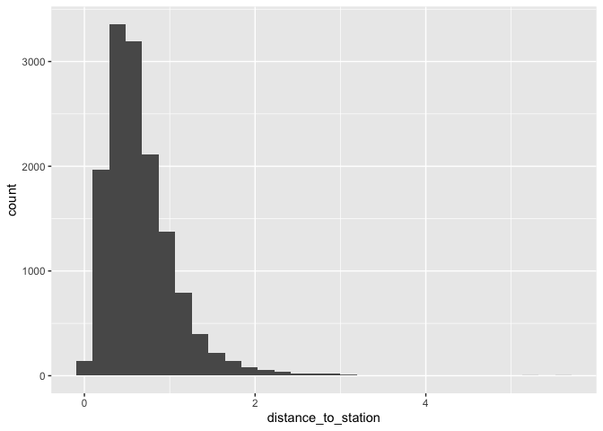
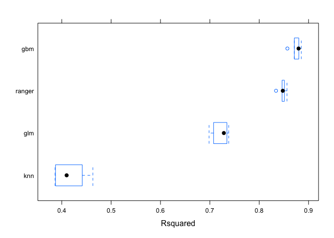
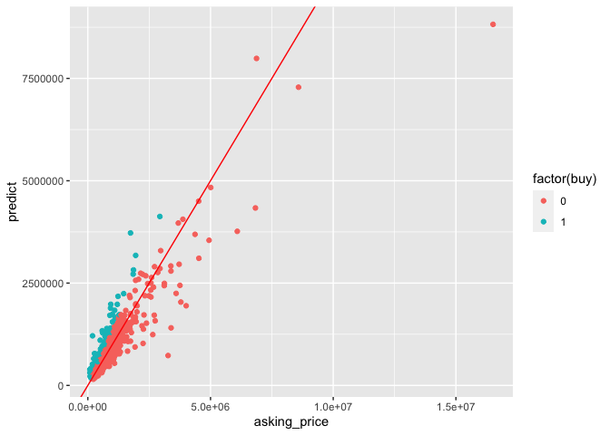

Data Science Capstone Project
================
Daniil Ennus

London Business School 

Data Science Course

# Introduction and outline

<div class="navy1">

The purpose of this exercise is to build an estimation engine to guide
investment decisions in London house market using machine
learning algorithms given variety of information about each property.

<b>Table of Contents</b>

<ol type="i">
<li>
Loading, cleaning, inspecting, and visualisign data. 
</li>
<li>
Linear Model
</li>
<li>
Decision Tree
</li>
<li>
Ada Boost
</li>
<li>
KNN
</li>
<li>
Random Forest
</li>
<li>
Stacking
</li>
<li>
Choosing Investments
</li>
</ol>

</div>

# Load data

There are two sets of data, i) training data that has the actual prices
ii) out of sample data that has the asking prices.

``` r
#read in the data

london_house_prices_2019_training<-read.csv("training_data_assignment_with_prices.csv")
london_house_prices_2019_out_of_sample<-read.csv("test_data_assignment.csv")

#fix data types in both data sets

#fix dates
london_house_prices_2019_training <- london_house_prices_2019_training %>% mutate(date=as.Date(date))
london_house_prices_2019_out_of_sample<-london_house_prices_2019_out_of_sample %>% mutate(date=as.Date(date))
#change characters to factors
london_house_prices_2019_training <- london_house_prices_2019_training %>% mutate_if(is.character,as.factor)
london_house_prices_2019_out_of_sample<-london_house_prices_2019_out_of_sample %>% mutate_if(is.character,as.factor)

#take a quick look at what's in the data
#str(london_house_prices_2019_training)
#str(london_house_prices_2019_out_of_sample)

# check if any data is missing
skimr::skim(london_house_prices_2019_training) # 69 records in  population missing
```

|                                                  |                             |
|:-------------------------------------------------|:----------------------------|
| Name                                             | london_house_prices_2019\_… |
| Number of rows                                   | 13998                       |
| Number of columns                                | 37                          |
| \_\_\_\_\_\_\_\_\_\_\_\_\_\_\_\_\_\_\_\_\_\_\_   |                             |
| Column type frequency:                           |                             |
| Date                                             | 1                           |
| factor                                           | 18                          |
| numeric                                          | 18                          |
| \_\_\_\_\_\_\_\_\_\_\_\_\_\_\_\_\_\_\_\_\_\_\_\_ |                             |
| Group variables                                  | None                        |

Data summary

**Variable type: Date**

| skim_variable | n_missing | complete_rate | min        | max        | median     | n_unique |
|:--------------|----------:|--------------:|:-----------|:-----------|:-----------|---------:|
| date          |         0 |             1 | 2019-01-02 | 2019-12-30 | 2019-07-22 |      263 |

**Variable type: factor**

| skim_variable           | n_missing | complete_rate | ordered | n_unique | top_counts                                 |
|:------------------------|----------:|--------------:|:--------|---------:|:-------------------------------------------|
| postcode                |         0 |          1.00 | FALSE   |    12635 | E11: 5, BR1: 4, CR0: 4, E17: 4             |
| property_type           |         0 |          1.00 | FALSE   |        4 | F: 5402, T: 4999, S: 2780, D: 817          |
| whether_old_or_new      |         0 |          1.00 | FALSE   |        2 | N: 13990, Y: 8                             |
| freehold_or_leasehold   |         0 |          1.00 | FALSE   |        2 | F: 8457, L: 5541                           |
| address1                |         0 |          1.00 | FALSE   |     2825 | 3: 220, 7: 212, 4: 204, 12: 197            |
| address2                |     10812 |          0.23 | FALSE   |      434 | FLA: 218, FLA: 214, FLA: 213, FLA: 160     |
| address3                |         0 |          1.00 | FALSE   |     8543 | LON: 25, GRE: 24, THE: 23, HIG: 21         |
| town                    |     13384 |          0.04 | FALSE   |      133 | WAL: 35, CHE: 33, STR: 27, CHI: 24         |
| local_aut               |         0 |          1.00 | FALSE   |       69 | LON: 7512, ROM: 396, BRO: 277, CRO: 243    |
| county                  |         0 |          1.00 | FALSE   |       33 | BRO: 861, CRO: 729, WAN: 702, HAV: 672     |
| postcode_short          |         0 |          1.00 | FALSE   |      247 | CR0: 243, SW1: 204, E17: 193, SW1: 187     |
| current_energy_rating   |         0 |          1.00 | FALSE   |        6 | D: 7075, C: 3488, E: 2646, B: 361          |
| windows_energy_eff      |         0 |          1.00 | FALSE   |        5 | Ave: 7819, Goo: 3244, Ver: 1698, Poo: 1231 |
| tenure                  |         0 |          1.00 | FALSE   |        3 | own: 11236, ren: 2503, ren: 259            |
| nearest_station         |         0 |          1.00 | FALSE   |      592 | rom: 201, cha: 103, bex: 99, har: 96       |
| water_company           |         0 |          1.00 | FALSE   |        5 | Tha: 10471, Aff: 1577, Ess: 1154, SES: 792 |
| district                |         0 |          1.00 | FALSE   |       33 | Cro: 925, Bro: 843, Hav: 681, Bex: 603     |
| type_of_closest_station |         0 |          1.00 | FALSE   |        3 | rai: 6512, tub: 4711, lig: 2775            |

**Variable type: numeric**

| skim_variable                | n_missing | complete_rate |      mean |        sd |       p0 |       p25 |       p50 |       p75 |       p100 | hist  |
|:-----------------------------|----------:|--------------:|----------:|----------:|---------:|----------:|----------:|----------:|-----------:|:------|
| ID                           |         0 |             1 |   8003.94 |   4622.57 |     2.00 |   4004.50 |   8015.50 |  12018.75 | 1.5996e+04 | ▇▇▇▇▇ |
| total_floor_area             |         0 |             1 |     92.55 |     45.08 |    21.00 |     64.00 |     83.00 |    108.00 | 4.8000e+02 | ▇▂▁▁▁ |
| number_habitable_rooms       |         0 |             1 |      4.31 |      1.66 |     1.00 |      3.00 |      4.00 |      5.00 | 1.4000e+01 | ▆▇▁▁▁ |
| co2_emissions_current        |         0 |             1 |      4.25 |      2.39 |     0.10 |      2.70 |      3.80 |      5.20 | 4.4000e+01 | ▇▁▁▁▁ |
| co2_emissions_potential      |         0 |             1 |      2.22 |      1.44 |    -0.50 |      1.30 |      1.80 |      2.70 | 2.0500e+01 | ▇▁▁▁▁ |
| energy_consumption_current   |         0 |             1 |    262.98 |     93.42 |    12.00 |    202.00 |    249.00 |    308.00 | 1.2960e+03 | ▇▅▁▁▁ |
| energy_consumption_potential |         0 |             1 |    141.38 |     78.06 |   -49.00 |     89.00 |    122.00 |    167.00 | 1.0230e+03 | ▇▂▁▁▁ |
| latitude                     |         0 |             1 |     51.49 |      0.08 |    51.30 |     51.43 |     51.49 |     51.56 | 5.1680e+01 | ▂▇▇▇▂ |
| longitude                    |         0 |             1 |     -0.11 |      0.16 |    -0.49 |     -0.21 |     -0.11 |      0.00 | 2.9000e-01 | ▂▅▇▅▂ |
| population                   |        69 |             1 |     83.74 |     43.71 |     1.00 |     52.00 |     79.00 |    109.00 | 5.1000e+02 | ▇▃▁▁▁ |
| altitude                     |         0 |             1 |     36.57 |     26.01 |     0.00 |     16.00 |     32.00 |     51.00 | 2.3900e+02 | ▇▃▁▁▁ |
| london_zone                  |         0 |             1 |      3.76 |      1.43 |     1.00 |      3.00 |      4.00 |      5.00 | 7.0000e+00 | ▇▇▇▆▅ |
| average_income               |         0 |             1 |  55334.70 |   8454.23 | 36000.00 |  49400.00 |  54600.00 |  60600.00 | 8.5200e+04 | ▃▇▆▂▁ |
| price                        |         0 |             1 | 593790.93 | 519158.10 | 77000.00 | 351000.00 | 460000.00 | 650000.00 | 1.0800e+07 | ▇▁▁▁▁ |
| num_tube_lines               |         0 |             1 |      0.44 |      0.74 |     0.00 |      0.00 |      0.00 |      1.00 | 6.0000e+00 | ▇▁▁▁▁ |
| num_rail_lines               |         0 |             1 |      0.58 |      0.51 |     0.00 |      0.00 |      1.00 |      1.00 | 2.0000e+00 | ▆▁▇▁▁ |
| num_light_rail_lines         |         0 |             1 |      0.24 |      0.43 |     0.00 |      0.00 |      0.00 |      0.00 | 1.0000e+00 | ▇▁▁▁▂ |
| distance_to_station          |         0 |             1 |      0.65 |      0.40 |     0.00 |      0.37 |      0.57 |      0.84 | 5.6100e+00 | ▇▁▁▁▁ |

``` r
skimr::skim(london_house_prices_2019_out_of_sample) # only 7 records in population missing
```

|                                                  |                             |
|:-------------------------------------------------|:----------------------------|
| Name                                             | london_house_prices_2019\_… |
| Number of rows                                   | 1999                        |
| Number of columns                                | 37                          |
| \_\_\_\_\_\_\_\_\_\_\_\_\_\_\_\_\_\_\_\_\_\_\_   |                             |
| Column type frequency:                           |                             |
| Date                                             | 1                           |
| factor                                           | 12                          |
| logical                                          | 6                           |
| numeric                                          | 18                          |
| \_\_\_\_\_\_\_\_\_\_\_\_\_\_\_\_\_\_\_\_\_\_\_\_ |                             |
| Group variables                                  | None                        |

Data summary

**Variable type: Date**

| skim_variable | n_missing | complete_rate | min | max  | median | n_unique |
|:--------------|----------:|--------------:|:----|:-----|:-------|---------:|
| date          |      1999 |             0 | Inf | -Inf | NA     |        0 |

**Variable type: factor**

| skim_variable           | n_missing | complete_rate | ordered | n_unique | top_counts                              |
|:------------------------|----------:|--------------:|:--------|---------:|:----------------------------------------|
| property_type           |         0 |          1.00 | FALSE   |        4 | F: 785, T: 688, S: 395, D: 131          |
| whether_old_or_new      |         0 |          1.00 | FALSE   |        2 | N: 1998, Y: 1                           |
| freehold_or_leasehold   |         0 |          1.00 | FALSE   |        2 | F: 1209, L: 790                         |
| town                    |      1916 |          0.04 | FALSE   |       54 | CHE: 7, WAL: 7, BLA: 3, FOR: 3          |
| postcode_short          |         0 |          1.00 | FALSE   |      221 | SW1: 40, CR0: 39, E17: 37, SW1: 28      |
| current_energy_rating   |         0 |          1.00 | FALSE   |        6 | D: 980, C: 514, E: 399, F: 52           |
| windows_energy_eff      |         0 |          1.00 | FALSE   |        5 | Ave: 1118, Goo: 475, Ver: 233, Poo: 172 |
| tenure                  |         0 |          1.00 | FALSE   |        3 | own: 1642, ren: 322, ren: 35            |
| nearest_station         |         0 |          1.00 | FALSE   |      494 | orp: 22, sid: 22, rom: 20, bex: 17      |
| water_company           |         0 |          1.00 | FALSE   |        4 | Tha: 1495, Aff: 238, Ess: 149, SES: 117 |
| district                |         0 |          1.00 | FALSE   |       32 | Cro: 136, Bro: 120, Bex: 93, Hav: 93    |
| type_of_closest_station |         0 |          1.00 | FALSE   |        3 | rai: 971, tub: 662, lig: 366            |

**Variable type: logical**

| skim_variable | n_missing | complete_rate | mean | count |
|:--------------|----------:|--------------:|-----:|:------|
| postcode      |      1999 |             0 |  NaN | :     |
| address1      |      1999 |             0 |  NaN | :     |
| address2      |      1999 |             0 |  NaN | :     |
| address3      |      1999 |             0 |  NaN | :     |
| local_aut     |      1999 |             0 |  NaN | :     |
| county        |      1999 |             0 |  NaN | :     |

**Variable type: numeric**

| skim_variable                | n_missing | complete_rate |      mean |        sd |       p0 |       p25 |       p50 |       p75 |       p100 | hist  |
|:-----------------------------|----------:|--------------:|----------:|----------:|---------:|----------:|----------:|----------:|-----------:|:------|
| ID                           |         0 |             1 |   7964.38 |   4587.52 |     1.00 |   3951.00 |   7911.00 |  11821.50 | 1.5997e+04 | ▇▇▇▇▇ |
| total_floor_area             |         0 |             1 |     94.36 |     49.05 |    24.00 |     63.00 |     82.00 |    111.00 | 4.6700e+02 | ▇▂▁▁▁ |
| number_habitable_rooms       |         0 |             1 |      4.37 |      1.76 |     1.00 |      3.00 |      4.00 |      5.00 | 1.2000e+01 | ▇▇▃▁▁ |
| co2_emissions_current        |         0 |             1 |      4.33 |      2.59 |     0.50 |      2.70 |      3.80 |      5.30 | 2.2000e+01 | ▇▃▁▁▁ |
| co2_emissions_potential      |         0 |             1 |      2.30 |      1.55 |     0.10 |      1.30 |      1.90 |      2.80 | 1.6000e+01 | ▇▂▁▁▁ |
| energy_consumption_current   |         0 |             1 |    264.11 |     95.68 |    61.00 |    199.00 |    250.00 |    308.50 | 8.6700e+02 | ▅▇▁▁▁ |
| energy_consumption_potential |         0 |             1 |    143.93 |     79.07 |     1.00 |     92.00 |    123.00 |    169.50 | 7.3200e+02 | ▇▃▁▁▁ |
| latitude                     |         0 |             1 |     51.49 |      0.08 |    51.30 |     51.43 |     51.49 |     51.56 | 5.1680e+01 | ▂▇▇▇▂ |
| longitude                    |         0 |             1 |     -0.11 |      0.16 |    -0.48 |     -0.21 |     -0.11 |      0.00 | 2.7000e-01 | ▂▆▇▅▂ |
| population                   |         7 |             1 |     83.06 |     44.35 |     4.00 |     52.00 |     78.00 |    107.00 | 6.2000e+02 | ▇▂▁▁▁ |
| altitude                     |         0 |             1 |     36.70 |     26.07 |     1.00 |     17.00 |     31.00 |     50.00 | 1.7500e+02 | ▇▅▁▁▁ |
| london_zone                  |         0 |             1 |      3.78 |      1.42 |     1.00 |      3.00 |      4.00 |      5.00 | 6.0000e+00 | ▆▇▆▆▅ |
| average_income               |         0 |             1 |  55541.92 |   8433.91 | 36500.00 |  49800.00 |  54700.00 |  60900.00 | 8.5200e+04 | ▃▇▆▂▁ |
| num_tube_lines               |         0 |             1 |      0.44 |      0.75 |     0.00 |      0.00 |      0.00 |      1.00 | 6.0000e+00 | ▇▁▁▁▁ |
| num_rail_lines               |         0 |             1 |      0.59 |      0.51 |     0.00 |      0.00 |      1.00 |      1.00 | 2.0000e+00 | ▆▁▇▁▁ |
| num_light_rail_lines         |         0 |             1 |      0.22 |      0.42 |     0.00 |      0.00 |      0.00 |      0.00 | 1.0000e+00 | ▇▁▁▁▂ |
| distance_to_station          |         0 |             1 |      0.65 |      0.39 |     0.01 |      0.38 |      0.57 |      0.83 | 3.1800e+00 | ▇▅▁▁▁ |
| asking_price                 |         0 |             1 | 626550.78 | 676909.46 | 83000.00 | 349500.00 | 473000.00 | 669500.00 | 1.6513e+07 | ▇▁▁▁▁ |

``` r
# date, postcode, address 1/2/3, local_aut, county town are useless


# drop NAs and rows in out_of_sample with 100% missing information
# there is no sense training model on variables you cannot use later for selection
london_house_prices_2019_training <- 
  london_house_prices_2019_training %>% 
  drop_na(population) %>% 
  select(-c(address1, address2, address3, local_aut,    county, town, postcode, date))

london_house_prices_2019_out_of_sample <- 
  london_house_prices_2019_out_of_sample %>% 
  drop_na(population) %>% 
  select(-c(address1, address2, address3, local_aut,    county, town, postcode, date))

# now both datasets have 100% complete rate. We sacrificed 7 observations in out_of_sample test. Even if  these were the most profitable deals, they won't affect average profit significantly
```

``` r
#let's do the initial split
set.seed(100)
library(rsample)
train_test_split <- initial_split(london_house_prices_2019_training, prop = 0.75) #training set contains 75% of the data
# Create the training dataset
train_data <- training(train_test_split)
test_data <- testing(train_test_split)

# remove redundant variable
rm(train_test_split)
```

# Visualize data

Visualize and examine the data.

``` r
# mean prices by rooms
london_house_prices_2019_training %>%
  group_by(number_habitable_rooms) %>% 
  summarise(mean = mean(price)) %>% 
  ggplot(aes(y = mean, x =number_habitable_rooms)) +
  geom_col()
```

<!-- -->

``` r
# meadian prices by London zone
london_house_prices_2019_training %>%
  group_by(london_zone) %>% 
  summarise(median = median(price)) %>% 
  ggplot(aes(x = london_zone, y =median)) +
  geom_col()
```

<!-- -->

``` r
# meadian prices by stations
london_house_prices_2019_training %>%
  group_by(nearest_station) %>% 
  summarise(median = median(price)) %>% 
  head(20) %>% 
  ggplot(aes(y = fct_reorder(nearest_station, median), x =median)) +
  geom_col()
```

<!-- -->

``` r
# relationship with Co2 emissions
london_house_prices_2019_training %>%
  ggplot(aes(x = co2_emissions_current, y = price)) +
  geom_point()
```

<!-- -->

``` r
# relationship with population
london_house_prices_2019_training %>%
  ggplot(aes(x = population, y = price)) +
  geom_point()
```

<!-- -->

``` r
# relationship with floor area
london_house_prices_2019_training %>%
  ggplot(aes(x = total_floor_area, y = price)) +
  geom_point()
```

<!-- -->

``` r
# relationship with number of rooms
london_house_prices_2019_training %>%
  ggplot(aes(x = number_habitable_rooms, y = price)) +
  geom_point()
```

<!-- -->

``` r
# relationship with energy consumption
london_house_prices_2019_training %>%
  ggplot(aes(x = energy_consumption_current, y = price)) +
  geom_point()
```

<!-- -->

``` r
# relationship with altitude
london_house_prices_2019_training %>%
  ggplot(aes(x = altitude, y = price)) +
  geom_point()
```

<!-- -->

``` r
# relationship with distance to station
london_house_prices_2019_training %>%
  ggplot(aes(x = distance_to_station, y = price)) +
  geom_point()
```

<!-- -->

``` r
# distribution of Co2 emissions
london_house_prices_2019_training %>%
  ggplot(aes(x = co2_emissions_current)) +
  geom_histogram()
```

<!-- -->

``` r
# distribution of population
london_house_prices_2019_training %>%
  ggplot(aes(x = population)) +
  geom_histogram()
```

<!-- -->

``` r
# distribution of floor area
london_house_prices_2019_training %>%
  ggplot(aes(x = total_floor_area)) +
  geom_histogram()
```

<!-- -->

``` r
# distribution of energy consumption
london_house_prices_2019_training %>%
  ggplot(aes(x = energy_consumption_current)) +
  geom_histogram()
```

<!-- -->

``` r
# distribution of altitude
london_house_prices_2019_training %>%
  ggplot(aes(x = altitude)) +
  geom_histogram()
```

<!-- -->

``` r
# distribution of income
london_house_prices_2019_training %>%
  ggplot(aes(x = average_income)) +
  geom_histogram()
```

<!-- -->

``` r
# distribution of distance to station
london_house_prices_2019_training %>%
  ggplot(aes(x = distance_to_station)) +
  geom_histogram()
```

<!-- -->

It is seen from the graphs that floor area and number of rooms are very
correlated with the price of the apartment. Distance to station also
plays an important role as well as London TFL zones.

Correlation table between prices and other continuous
variables.

``` r
# produce a correlation table using GGally::ggcor()
# this takes a while to plot

library("GGally")
london_house_prices_2019_training %>% 
  select(-ID) %>% 
  select(-price,price) %>% #keep Y variable last
  ggcorr(method = c("pairwise", "pearson"), layout.exp = 2,label_round=2, label = TRUE,label_size = 2,hjust = 1,nbreaks = 5,size = 2,angle = -20)
```

<!-- -->

Very logically, price is positively and strongly correlated with the
size of an apartment: \# of bedrooms, floor area. Also, it is positively
correlated with CO2 emissions, which can serve as a proxy for the age of
an apartment: newer or renovated apartments are more expensive. Also,
number of tube and rail lines seem to have some information about
prices. Finally, London TFL zone also determines the price: apartments
closer to the center (Zone 1) are more expensive. To sum up, key
determinants of the price are size, age, and location.

# Fit a linear regression model

I start by building a linear regression model below. I chose a subset of
the features with no particular goal.

``` r
set.seed(100)
#Define control variables
control <- trainControl (
    method="cv",
    number=5,
    verboseIter=TRUE) #by setting this to true the model will report its progress after each estimation

#we are going to train the model and report the results using k-fold cross validation
model1_lm<-train(
    price ~ distance_to_station +water_company+property_type+whether_old_or_new+freehold_or_leasehold+latitude+ longitude,
    train_data,
   method = "lm",
    trControl = control
   )
```

    ## + Fold1: intercept=TRUE 
    ## - Fold1: intercept=TRUE 
    ## + Fold2: intercept=TRUE 
    ## - Fold2: intercept=TRUE 
    ## + Fold3: intercept=TRUE 
    ## - Fold3: intercept=TRUE 
    ## + Fold4: intercept=TRUE 
    ## - Fold4: intercept=TRUE 
    ## + Fold5: intercept=TRUE 
    ## - Fold5: intercept=TRUE 
    ## Aggregating results
    ## Fitting final model on full training set

``` r
# summary of the results
summary(model1_lm)
```

    ## 
    ## Call:
    ## lm(formula = .outcome ~ ., data = dat)
    ## 
    ## Residuals:
    ##     Min      1Q  Median      3Q     Max 
    ## -999378 -195530  -65778   68826 9697141 
    ## 
    ## Coefficients:
    ##                                       Estimate Std. Error t value Pr(>|t|)    
    ## (Intercept)                          -51013168    3706990 -13.761  < 2e-16 ***
    ## distance_to_station                    -143710      12353 -11.633  < 2e-16 ***
    ## `water_companyEssex & Suffolk Water`    405817      29178  13.908  < 2e-16 ***
    ## `water_companyLeep Utilities`           547643     235366   2.327     0.02 *  
    ## `water_companySES Water`                284557      29591   9.616  < 2e-16 ***
    ## `water_companyThames Water`             503667      19763  25.486  < 2e-16 ***
    ## property_typeF                         -543678      41701 -13.038  < 2e-16 ***
    ## property_typeS                         -380699      21660 -17.576  < 2e-16 ***
    ## property_typeT                         -425242      20833 -20.412  < 2e-16 ***
    ## whether_old_or_newY                      26491     209835   0.126     0.90    
    ## freehold_or_leaseholdL                 -147815      36599  -4.039 5.41e-05 ***
    ## latitude                               1003219      71855  13.962  < 2e-16 ***
    ## longitude                             -1048024      40420 -25.928  < 2e-16 ***
    ## ---
    ## Signif. codes:  0 '***' 0.001 '**' 0.01 '*' 0.05 '.' 0.1 ' ' 1
    ## 
    ## Residual standard error: 468800 on 10433 degrees of freedom
    ## Multiple R-squared:  0.1903, Adjusted R-squared:  0.1894 
    ## F-statistic: 204.3 on 12 and 10433 DF,  p-value: < 2.2e-16

``` r
# Adjusted R-squared:  0.1894 
# Residual standard error: 468800

predictions <- predict(model1_lm,test_data)

lr_results<-data.frame(  RMSE = RMSE(predictions, test_data$price), 
                            Rsquare = R2(predictions, test_data$price))

                            
lr_results # Rsquare 0.1471391, RMSE 478355.7
```

    ##       RMSE   Rsquare
    ## 1 478355.7 0.1471391

``` r
# add more variables

model2_lm<-train(
     price~ total_floor_area + factor(london_zone) + longitude + average_income + 
                 co2_emissions_potential+ co2_emissions_current + latitude +
                 population + energy_consumption_current + altitude + distance_to_station +
                 number_habitable_rooms + energy_consumption_potential + property_type + whether_old_or_new+
              num_tube_lines + num_rail_lines + num_light_rail_lines,
    train_data,
   method = "lm",
    trControl = control
   )
```

    ## + Fold1: intercept=TRUE 
    ## - Fold1: intercept=TRUE 
    ## + Fold2: intercept=TRUE 
    ## - Fold2: intercept=TRUE 
    ## + Fold3: intercept=TRUE 
    ## - Fold3: intercept=TRUE 
    ## + Fold4: intercept=TRUE 
    ## - Fold4: intercept=TRUE 
    ## + Fold5: intercept=TRUE 
    ## - Fold5: intercept=TRUE 
    ## Aggregating results
    ## Fitting final model on full training set

``` r
# summary of the results
summary(model2_lm)
```

    ## 
    ## Call:
    ## lm(formula = .outcome ~ ., data = dat)
    ## 
    ## Residuals:
    ##      Min       1Q   Median       3Q      Max 
    ## -1773578  -106029     3061   101194  6873763 
    ## 
    ## Coefficients:
    ##                                Estimate Std. Error t value Pr(>|t|)    
    ## (Intercept)                  -1.188e+07  2.259e+06  -5.258 1.48e-07 ***
    ## total_floor_area              8.384e+03  1.853e+02  45.246  < 2e-16 ***
    ## `factor(london_zone)2`       -5.125e+05  1.815e+04 -28.242  < 2e-16 ***
    ## `factor(london_zone)3`       -6.732e+05  1.866e+04 -36.076  < 2e-16 ***
    ## `factor(london_zone)4`       -7.600e+05  1.919e+04 -39.613  < 2e-16 ***
    ## `factor(london_zone)5`       -7.829e+05  1.977e+04 -39.596  < 2e-16 ***
    ## `factor(london_zone)6`       -7.706e+05  2.004e+04 -38.450  < 2e-16 ***
    ## `factor(london_zone)7`       -8.653e+05  1.485e+05  -5.826 5.85e-09 ***
    ## longitude                    -2.237e+05  2.002e+04 -11.176  < 2e-16 ***
    ## average_income                6.801e+00  4.012e-01  16.953  < 2e-16 ***
    ## co2_emissions_potential       4.374e+04  6.429e+03   6.804 1.07e-11 ***
    ## co2_emissions_current        -1.081e+04  4.223e+03  -2.560   0.0105 *  
    ## latitude                      2.342e+05  4.381e+04   5.346 9.20e-08 ***
    ## population                   -4.872e+02  6.834e+01  -7.129 1.08e-12 ***
    ## energy_consumption_current    4.224e+02  7.618e+01   5.545 3.02e-08 ***
    ## altitude                     -5.827e+02  1.242e+02  -4.691 2.75e-06 ***
    ## distance_to_station          -3.440e+03  8.011e+03  -0.429   0.6677    
    ## number_habitable_rooms       -3.785e+04  3.539e+03 -10.694  < 2e-16 ***
    ## energy_consumption_potential -5.957e+02  1.030e+02  -5.784 7.52e-09 ***
    ## property_typeF                4.021e+04  1.693e+04   2.375   0.0176 *  
    ## property_typeS                3.328e+04  1.426e+04   2.334   0.0196 *  
    ## property_typeT                9.269e+04  1.452e+04   6.384 1.80e-10 ***
    ## whether_old_or_newY           8.084e+04  1.316e+05   0.614   0.5391    
    ## num_tube_lines                2.058e+04  5.812e+03   3.541   0.0004 ***
    ## num_rail_lines               -5.865e+03  7.931e+03  -0.739   0.4596    
    ## num_light_rail_lines         -1.341e+04  7.920e+03  -1.693   0.0905 .  
    ## ---
    ## Signif. codes:  0 '***' 0.001 '**' 0.01 '*' 0.05 '.' 0.1 ' ' 1
    ## 
    ## Residual standard error: 293500 on 10420 degrees of freedom
    ## Multiple R-squared:  0.683,  Adjusted R-squared:  0.6822 
    ## F-statistic: 897.9 on 25 and 10420 DF,  p-value: < 2.2e-16

``` r
# Multiple R-squared:  0.6822
# Residual standard error: 293500


# Expand the model even further
model3_lm<-train(
     price~ total_floor_area + factor(london_zone) + longitude + average_income + 
                 co2_emissions_potential+ co2_emissions_current + latitude +
                 population + energy_consumption_current + altitude + distance_to_station +
                 number_habitable_rooms + energy_consumption_potential + property_type + whether_old_or_new+
              num_tube_lines + num_rail_lines + num_light_rail_lines +
                 freehold_or_leasehold + current_energy_rating + windows_energy_eff +
                 tenure + water_company + district + type_of_closest_station,
    train_data,
   method = "lm",
    trControl = control
   )
```

    ## + Fold1: intercept=TRUE 
    ## - Fold1: intercept=TRUE 
    ## + Fold2: intercept=TRUE 
    ## - Fold2: intercept=TRUE 
    ## + Fold3: intercept=TRUE 
    ## - Fold3: intercept=TRUE 
    ## + Fold4: intercept=TRUE 
    ## - Fold4: intercept=TRUE 
    ## + Fold5: intercept=TRUE 
    ## - Fold5: intercept=TRUE 
    ## Aggregating results
    ## Fitting final model on full training set

``` r
# summary of the results
summary(model3_lm)
```

    ## 
    ## Call:
    ## lm(formula = .outcome ~ ., data = dat)
    ## 
    ## Residuals:
    ##      Min       1Q   Median       3Q      Max 
    ## -1588442   -96117     8446    96637  6508351 
    ## 
    ## Coefficients:
    ##                                        Estimate Std. Error t value Pr(>|t|)    
    ## (Intercept)                          -1.327e+07  7.710e+06  -1.721 0.085201 .  
    ## total_floor_area                      7.788e+03  1.773e+02  43.937  < 2e-16 ***
    ## `factor(london_zone)2`               -3.272e+05  1.995e+04 -16.406  < 2e-16 ***
    ## `factor(london_zone)3`               -4.068e+05  2.385e+04 -17.052  < 2e-16 ***
    ## `factor(london_zone)4`               -4.761e+05  2.572e+04 -18.515  < 2e-16 ***
    ## `factor(london_zone)5`               -5.025e+05  2.685e+04 -18.716  < 2e-16 ***
    ## `factor(london_zone)6`               -4.946e+05  2.783e+04 -17.775  < 2e-16 ***
    ## `factor(london_zone)7`               -5.689e+05  1.411e+05  -4.033 5.54e-05 ***
    ## longitude                             2.177e+05  9.249e+04   2.353 0.018626 *  
    ## average_income                        6.170e+00  4.239e-01  14.555  < 2e-16 ***
    ## co2_emissions_potential               3.817e+04  6.105e+03   6.252 4.22e-10 ***
    ## co2_emissions_current                -2.230e+03  4.095e+03  -0.545 0.586051    
    ## latitude                              2.571e+05  1.494e+05   1.720 0.085395 .  
    ## population                           -3.510e+02  6.517e+01  -5.386 7.34e-08 ***
    ## energy_consumption_current            4.509e+02  8.400e+01   5.368 8.12e-08 ***
    ## altitude                              8.209e+01  1.832e+02   0.448 0.654178    
    ## distance_to_station                  -4.412e+03  7.879e+03  -0.560 0.575482    
    ## number_habitable_rooms               -3.478e+04  3.364e+03 -10.338  < 2e-16 ***
    ## energy_consumption_potential         -4.782e+02  1.002e+02  -4.774 1.83e-06 ***
    ## property_typeF                        2.463e+04  2.571e+04   0.958 0.338014    
    ## property_typeS                        1.637e+04  1.345e+04   1.217 0.223490    
    ## property_typeT                        6.566e+04  1.370e+04   4.793 1.67e-06 ***
    ## whether_old_or_newY                   6.890e+04  1.240e+05   0.556 0.578367    
    ## num_tube_lines                       -1.920e+04  8.915e+03  -2.153 0.031313 *  
    ## num_rail_lines                        5.922e+03  1.054e+04   0.562 0.574220    
    ## num_light_rail_lines                 -1.288e+04  1.659e+04  -0.776 0.437544    
    ## freehold_or_leaseholdL               -2.961e+04  2.180e+04  -1.358 0.174384    
    ## current_energy_ratingC               -7.745e+03  1.856e+04  -0.417 0.676455    
    ## current_energy_ratingD               -2.250e+04  2.008e+04  -1.120 0.262604    
    ## current_energy_ratingE               -6.672e+04  2.395e+04  -2.786 0.005346 ** 
    ## current_energy_ratingF               -1.320e+05  3.342e+04  -3.950 7.87e-05 ***
    ## current_energy_ratingG               -2.024e+05  5.105e+04  -3.966 7.36e-05 ***
    ## windows_energy_effGood                1.668e+04  6.924e+03   2.409 0.016034 *  
    ## windows_energy_effPoor                7.195e+04  1.031e+04   6.978 3.19e-12 ***
    ## `windows_energy_effVery Good`        -1.714e+05  1.948e+05  -0.880 0.379046    
    ## `windows_energy_effVery Poor`         3.666e+04  9.451e+03   3.879 0.000106 ***
    ## `tenurerental (private)`             -1.577e+04  7.450e+03  -2.117 0.034297 *  
    ## `tenurerental (social)`              -4.056e+04  1.975e+04  -2.054 0.040018 *  
    ## `water_companyEssex & Suffolk Water` -2.771e+04  3.484e+04  -0.795 0.426505    
    ## `water_companyLeep Utilities`         2.638e+04  1.392e+05   0.189 0.849716    
    ## `water_companySES Water`             -4.055e+04  2.880e+04  -1.408 0.159062    
    ## `water_companyThames Water`           2.818e+04  1.920e+04   1.468 0.142140    
    ## districtBarnet                        5.591e+04  4.620e+04   1.210 0.226234    
    ## districtBexley                       -6.336e+04  4.053e+04  -1.563 0.118079    
    ## districtBrent                         1.202e+05  4.998e+04   2.404 0.016224 *  
    ## districtBromley                      -3.484e+04  4.429e+04  -0.787 0.431516    
    ## districtCamden                        2.023e+05  4.741e+04   4.266 2.00e-05 ***
    ## `districtCity of London`              4.024e+04  1.447e+05   0.278 0.781004    
    ## districtCroydon                      -4.423e+04  4.720e+04  -0.937 0.348720    
    ## districtEaling                        1.102e+05  5.223e+04   2.110 0.034895 *  
    ## districtEnfield                      -1.566e+04  4.244e+04  -0.369 0.712229    
    ## districtGreenwich                    -4.441e+04  4.046e+04  -1.098 0.272424    
    ## districtHackney                       6.410e+04  4.392e+04   1.459 0.144498    
    ## `districtHammersmith and Fulham`      2.923e+05  5.204e+04   5.617 1.99e-08 ***
    ## districtHaringey                      5.788e+04  4.428e+04   1.307 0.191219    
    ## districtHarrow                        7.144e+04  5.602e+04   1.275 0.202269    
    ## districtHavering                     -5.516e+04  2.768e+04  -1.993 0.046285 *  
    ## districtHillingdon                    1.235e+05  5.904e+04   2.093 0.036397 *  
    ## districtHounslow                      1.552e+05  5.449e+04   2.849 0.004397 ** 
    ## districtIslington                     7.586e+04  4.642e+04   1.634 0.102242    
    ## `districtKensington and Chelsea`      8.210e+05  5.127e+04  16.015  < 2e-16 ***
    ## `districtKingston upon Thames`        1.121e+05  5.337e+04   2.101 0.035698 *  
    ## districtLambeth                       3.228e+04  4.691e+04   0.688 0.491407    
    ## districtLewisham                     -6.011e+04  4.282e+04  -1.404 0.160399    
    ## districtMerton                        7.859e+04  4.902e+04   1.603 0.108941    
    ## districtNewham                       -5.017e+04  4.134e+04  -1.213 0.224967    
    ## districtRedbridge                    -7.528e+04  3.027e+04  -2.487 0.012893 *  
    ## `districtRichmond upon Thames`        2.245e+05  5.348e+04   4.198 2.72e-05 ***
    ## districtSouthwark                     9.806e+03  4.484e+04   0.219 0.826878    
    ## districtSutton                        1.000e+05  5.218e+04   1.917 0.055222 .  
    ## `districtTower Hamlets`              -4.885e+04  4.458e+04  -1.096 0.273227    
    ## `districtWaltham Forest`              1.272e+04  3.953e+04   0.322 0.747687    
    ## districtWandsworth                    9.811e+04  4.728e+04   2.075 0.038024 *  
    ## districtWestminster                   4.195e+05  5.081e+04   8.255  < 2e-16 ***
    ## type_of_closest_stationrail          -2.478e+04  2.053e+04  -1.207 0.227373    
    ## type_of_closest_stationtube           1.257e+04  2.001e+04   0.628 0.529912    
    ## ---
    ## Signif. codes:  0 '***' 0.001 '**' 0.01 '*' 0.05 '.' 0.1 ' ' 1
    ## 
    ## Residual standard error: 274500 on 10370 degrees of freedom
    ## Multiple R-squared:  0.7241, Adjusted R-squared:  0.7221 
    ## F-statistic: 362.8 on 75 and 10370 DF,  p-value: < 2.2e-16

``` r
# Multiple R-squared:  0.7221,
# Residual standard error: 274500
```

``` r
# we can check variable importance as well
importance <- varImp(model1_lm, scale=TRUE)
plot(importance)
```

<!-- -->

``` r
importance <- varImp(model3_lm, scale=TRUE)
plot(importance, 25)
```

<!-- -->

## Predict the values in testing and out of sample data

Below I use the predict function to test the performance of the model in
testing data and summarize the performance of the linear regression
model.

``` r
# We can predict the testing values
predictions <- predict(model1_lm,test_data)

lr_results<-data.frame(  RMSE = RMSE(predictions, test_data$price), 
                            Rsquare = R2(predictions, test_data$price))

# Performance of the base linear model                         
lr_results # Rsquare 0.1471391, RMSE 478355.7               
```

    ##       RMSE   Rsquare
    ## 1 478355.7 0.1471391

``` r
#We can predict prices for out of sample data the same way
predictions_oos <- predict(model1_lm,london_house_prices_2019_out_of_sample)


# We can predict the testing values
predictions <- predict(model3_lm,test_data)

lr_results<-data.frame(  RMSE = RMSE(predictions, test_data$price), 
                            Rsquare = R2(predictions, test_data$price))

# Performance of the linear model with much better combination of variables 
lr_results # Rsquare 0.6405743, RMSE 310364.7
```

    ##       RMSE   Rsquare
    ## 1 310364.7 0.6405743

# Fit a tree model

Next I fit a tree model using the same subset of features.

``` r
model2_tree <- train(
  price ~ distance_to_station +water_company+property_type+whether_old_or_new+latitude+ longitude,
  train_data,
  method = "rpart",
  trControl = control,
  tuneLength=10
    )
```

    ## + Fold1: cp=0.01095 
    ## - Fold1: cp=0.01095 
    ## + Fold2: cp=0.01095 
    ## - Fold2: cp=0.01095 
    ## + Fold3: cp=0.01095 
    ## - Fold3: cp=0.01095 
    ## + Fold4: cp=0.01095 
    ## - Fold4: cp=0.01095 
    ## + Fold5: cp=0.01095 
    ## - Fold5: cp=0.01095 
    ## Aggregating results
    ## Selecting tuning parameters
    ## Fitting cp = 0.0109 on full training set

``` r
#You can view how the tree performs
model2_tree$results
```

    ##            cp     RMSE   Rsquared      MAE   RMSESD RsquaredSD     MAESD
    ## 1  0.01094822 417164.9 0.36651979 224259.8 20258.34 0.05761167  7708.117
    ## 2  0.01302444 420244.0 0.35363924 229560.2 17560.26 0.06369993  6673.439
    ## 3  0.01312132 420244.0 0.35363924 229560.2 17560.26 0.06369993  6673.439
    ## 4  0.01463848 423788.8 0.34316919 232134.5 16205.35 0.05985652  4278.951
    ## 5  0.02411669 427559.2 0.32692166 233955.1 14713.42 0.06213048  3995.551
    ## 6  0.02583090 427559.2 0.32692166 233955.1 14713.42 0.06213048  3995.551
    ## 7  0.03509931 458453.9 0.22974850 243033.9 34101.73 0.04487868  8688.613
    ## 8  0.05153976 470541.7 0.18885884 247356.8 36212.21 0.02826933  8503.504
    ## 9  0.05439145 488156.1 0.11693940 261769.9 36123.77 0.07032858 13004.150
    ## 10 0.05536516 509989.1 0.06482658 278627.8 42100.13 0.02188380 13834.287

``` r
#You can view the final tree
rpart.plot(model2_tree$finalModel)
```

<!-- -->

``` r
#visualize the variable importance
importance <- varImp(model2_tree, scale=TRUE)
plot(importance)
```

<!-- -->

``` r
#### Now let's add more variables
set.seed(100)

model3_tree <- train(
  price~ total_floor_area + factor(london_zone) + longitude + average_income + 
                 co2_emissions_potential+ co2_emissions_current + latitude +
                 population + energy_consumption_current + altitude + distance_to_station +
                 number_habitable_rooms + energy_consumption_potential + property_type + whether_old_or_new+
              num_tube_lines + num_rail_lines + num_light_rail_lines +
                 freehold_or_leasehold + current_energy_rating + windows_energy_eff +
                 tenure + water_company + district + type_of_closest_station,
  train_data,
  method = "rpart",
  trControl = control,
  tuneLength=10
    )
```

    ## + Fold1: cp=0.01365 
    ## - Fold1: cp=0.01365 
    ## + Fold2: cp=0.01365 
    ## - Fold2: cp=0.01365 
    ## + Fold3: cp=0.01365 
    ## - Fold3: cp=0.01365 
    ## + Fold4: cp=0.01365 
    ## - Fold4: cp=0.01365 
    ## + Fold5: cp=0.01365 
    ## - Fold5: cp=0.01365 
    ## Aggregating results
    ## Selecting tuning parameters
    ## Fitting cp = 0.0137 on full training set

``` r
# Check how the tree performs
model3_tree$results
```

    ##            cp     RMSE  Rsquared      MAE   RMSESD  RsquaredSD     MAESD
    ## 1  0.01365108 314180.7 0.6406355 179881.2 24267.56 0.056907412  5305.340
    ## 2  0.01453156 316844.0 0.6337531 181428.7 24809.61 0.062124770  5401.861
    ## 3  0.01880166 325228.4 0.6121425 186934.1 27069.68 0.078542712  8033.953
    ## 4  0.02595312 345820.3 0.5623466 197171.6 29145.68 0.080456730  7383.811
    ## 5  0.03009456 358316.9 0.5318710 199048.7 26235.23 0.069034780  6676.915
    ## 6  0.03409492 359948.9 0.5281440 199877.1 24912.14 0.064269398  6390.720
    ## 7  0.04793099 367739.8 0.5089795 201876.3 19020.72 0.044097374  4996.715
    ## 8  0.08093204 363076.0 0.5131173 201432.1 19820.23 0.048312243  4674.747
    ## 9  0.11359254 423183.5 0.3397190 238984.2 27163.71 0.068079948  4483.663
    ## 10 0.32523559 490700.6 0.2697796 269012.6 53355.20 0.006387443 28295.653

``` r
# View the final tree
rpart.plot(model3_tree$finalModel)
```

<!-- -->

``` r
# Visualize the variable importance
importance <- varImp(model3_tree, scale=TRUE)
plot(importance, 25)
```

<!-- -->

``` r
# We can predict the testing values
predictions <- predict(model3_tree,test_data)

lr_results<-data.frame(  RMSE = RMSE(predictions, test_data$price), 
                            Rsquare = R2(predictions, test_data$price))


# Performance of the tree model                           
lr_results # Rsquare 0.6050794, RMSE 324883.5
```

    ##       RMSE   Rsquare
    ## 1 324883.5 0.6050794

As seen from out-of-sample R2 and RMSE, linear model performs better (R2
0.6405743 vs 0.6050794 and RMSE 310364.7 vs 324883.5) if we use the same
variables for the out-of-sample prediction. Usually, linear model is
generally stronger than a decision tree because parametric approach
works very well when we have large samples and many continuous
variables. Moreover, linear model is more stable and is not as much
affected by (minor) changes in sample and variable selection unlike
decision trees. However, the performance is not significantly different.
Also, both models assign similar importance to the variables, but the
combinations are slightly different.

# Other algorithms

## Ada Boost

Let’s start with Ada Boost model to set a baseline values for R2, RMSE
and other metrics. First, let’s keep the baseline variables we used
before to compare GBM with OLS.

``` r
# Ada boost model with all variables as a baseline 

set.seed(100)

grid<-expand.grid(interaction.depth = 6,n.trees = 200,shrinkage =c(0.03), n.minobsinnode = 10)

gbmFit1 <-  train(
               price~ distance_to_station +water_company+property_type+whether_old_or_new+latitude+ longitude, 
               data=train_data, 
                 method = "gbm", 
                 trControl = control,
                 preProcess = c("center", "scale"),
                tuneGrid=grid,
                verbose=FALSE
                 )
```

    ## + Fold1: interaction.depth=6, n.trees=200, shrinkage=0.03, n.minobsinnode=10 
    ## - Fold1: interaction.depth=6, n.trees=200, shrinkage=0.03, n.minobsinnode=10 
    ## + Fold2: interaction.depth=6, n.trees=200, shrinkage=0.03, n.minobsinnode=10 
    ## - Fold2: interaction.depth=6, n.trees=200, shrinkage=0.03, n.minobsinnode=10 
    ## + Fold3: interaction.depth=6, n.trees=200, shrinkage=0.03, n.minobsinnode=10 
    ## - Fold3: interaction.depth=6, n.trees=200, shrinkage=0.03, n.minobsinnode=10 
    ## + Fold4: interaction.depth=6, n.trees=200, shrinkage=0.03, n.minobsinnode=10 
    ## - Fold4: interaction.depth=6, n.trees=200, shrinkage=0.03, n.minobsinnode=10 
    ## + Fold5: interaction.depth=6, n.trees=200, shrinkage=0.03, n.minobsinnode=10 
    ## - Fold5: interaction.depth=6, n.trees=200, shrinkage=0.03, n.minobsinnode=10 
    ## Aggregating results
    ## Fitting final model on full training set

``` r
summary(gbmFit1)
```

<!-- -->

    ##                                                                   var   rel.inf
    ## latitude                                                     latitude 36.151964
    ## longitude                                                   longitude 34.479750
    ## property_typeF                                         property_typeF 14.979430
    ## water_companyThames Water                   water_companyThames Water  6.512776
    ## property_typeT                                         property_typeT  3.364402
    ## property_typeS                                         property_typeS  3.089802
    ## distance_to_station                               distance_to_station  1.421877
    ## water_companyEssex & Suffolk Water water_companyEssex & Suffolk Water  0.000000
    ## water_companyLeep Utilities               water_companyLeep Utilities  0.000000
    ## water_companySES Water                         water_companySES Water  0.000000
    ## whether_old_or_newY                               whether_old_or_newY  0.000000

``` r
print(gbmFit1)
```

    ## Stochastic Gradient Boosting 
    ## 
    ## 10446 samples
    ##     6 predictor
    ## 
    ## Pre-processing: centered (11), scaled (11) 
    ## Resampling: Cross-Validated (5 fold) 
    ## Summary of sample sizes: 8356, 8358, 8356, 8358, 8356 
    ## Resampling results:
    ## 
    ##   RMSE      Rsquared   MAE     
    ##   346245.1  0.5681488  172423.6
    ## 
    ## Tuning parameter 'n.trees' was held constant at a value of 200
    ## Tuning
    ## 
    ## Tuning parameter 'shrinkage' was held constant at a value of 0.03
    ## 
    ## Tuning parameter 'n.minobsinnode' was held constant at a value of 10

``` r
# Check out of sample performance
pred <- predict(gbmFit1, test_data)

# R2
gbmFit1$results$Rsquared # in-sample R2 0.5681488
```

    ## [1] 0.5681488

``` r
R2(pred, test_data$price) # out-sample R2 0.5103124 vs 0.1471391 OLS
```

    ## [1] 0.5103124

``` r
# RMSE
gbmFit1$results$RMSE # in-sample RMSE 346245.1
```

    ## [1] 346245.1

``` r
RMSE(pred, test_data$price) # out-sample RMSE 364576.1 vs 478355.7 OLS
```

    ## [1] 364576.1

``` r
# plot data
df <- data.frame(test_data$price ,pred) %>% 
  rename(actual = test_data.price,
         prediction = pred)
ggplot(aes(x = actual, y = prediction), data = df) +
  geom_point() +
  geom_abline(slope = 1, color = 'red')
```

<!-- -->

``` r
# Log scale
ggplot(aes(x = log(actual), y = log(prediction)), data = df) +
  geom_point() +
  geom_abline(slope = 1, color = 'red')
```

<!-- -->

## Ada Boost v2

Now let’s imporve the model and add all the remaining variables in the
dataframe

``` r
# Ada boost model with all variables as a baseline 

set.seed(100)

# Different grids I experimented with: 

#grid<-expand.grid(interaction.depth = 6,n.trees = 200,shrinkage =c(0.03), n.minobsinnode = 10)
#grid<-expand.grid(interaction.depth = seq(4,8,2),n.trees = seq(160, 220, 20),shrinkage =seq(0, 0.03, 0.01), #n.minobsinnode = 10)
#grid<-expand.grid(interaction.depth = seq(6,10,2),n.trees = seq(200, 260, 20),shrinkage =seq(0.03, 0.06, 0.01), #n.minobsinnode = 10)
#grid<-expand.grid(interaction.depth = 8,n.trees = 1000,shrinkage =seq(0.06, 0.1, 0.01), n.minobsinnode = seq(6, 22, 4))

# Optimal model
# Fitting n.trees = 1000, interaction.depth = 8, shrinkage = 0.06, n.minobsinnode = 6 on full training set
######

# Final version:
grid<-expand.grid(interaction.depth = 8,n.trees = 1000,shrinkage = 0.06, n.minobsinnode = 6)

set.seed(100)

# Final model after variable and hyperparameter tuning
gbmFit1 <-  train(
               price~ total_floor_area + factor(london_zone) + longitude + average_income + 
                 co2_emissions_potential+ co2_emissions_current + latitude +
                 population + energy_consumption_current + altitude + distance_to_station +
                 number_habitable_rooms + energy_consumption_potential + property_type + whether_old_or_new+
              num_tube_lines + num_rail_lines + num_light_rail_lines 
              + substr(postcode_short, 1, 1),
                 #freehold_or_leasehold + current_energy_rating + windows_energy_eff +
                 #tenure + water_company + district + type_of_closest_station, 
               data=train_data, 
                 method = "gbm", 
                 trControl = control,
                 preProcess = c("center", "scale"),
                tuneGrid=grid,
                verbose=FALSE
                 )
```

    ## + Fold1: interaction.depth=8, n.trees=1000, shrinkage=0.06, n.minobsinnode=6 
    ## - Fold1: interaction.depth=8, n.trees=1000, shrinkage=0.06, n.minobsinnode=6 
    ## + Fold2: interaction.depth=8, n.trees=1000, shrinkage=0.06, n.minobsinnode=6 
    ## - Fold2: interaction.depth=8, n.trees=1000, shrinkage=0.06, n.minobsinnode=6 
    ## + Fold3: interaction.depth=8, n.trees=1000, shrinkage=0.06, n.minobsinnode=6 
    ## - Fold3: interaction.depth=8, n.trees=1000, shrinkage=0.06, n.minobsinnode=6 
    ## + Fold4: interaction.depth=8, n.trees=1000, shrinkage=0.06, n.minobsinnode=6 
    ## - Fold4: interaction.depth=8, n.trees=1000, shrinkage=0.06, n.minobsinnode=6 
    ## + Fold5: interaction.depth=8, n.trees=1000, shrinkage=0.06, n.minobsinnode=6 
    ## - Fold5: interaction.depth=8, n.trees=1000, shrinkage=0.06, n.minobsinnode=6 
    ## Aggregating results
    ## Fitting final model on full training set

``` r
summary(gbmFit1)
```

<!-- -->

    ##                                                         var      rel.inf
    ## total_floor_area                           total_floor_area 5.076214e+01
    ## num_tube_lines                               num_tube_lines 1.043783e+01
    ## longitude                                         longitude 8.711993e+00
    ## latitude                                           latitude 5.247807e+00
    ## average_income                               average_income 4.444736e+00
    ## population                                       population 3.041602e+00
    ## altitude                                           altitude 2.825826e+00
    ## co2_emissions_potential             co2_emissions_potential 2.714070e+00
    ## factor(london_zone)2                   factor(london_zone)2 2.461321e+00
    ## energy_consumption_current       energy_consumption_current 1.474927e+00
    ## co2_emissions_current                 co2_emissions_current 1.441592e+00
    ## distance_to_station                     distance_to_station 1.194330e+00
    ## property_typeF                               property_typeF 1.081843e+00
    ## energy_consumption_potential   energy_consumption_potential 9.582660e-01
    ## number_habitable_rooms               number_habitable_rooms 6.845200e-01
    ## num_rail_lines                               num_rail_lines 4.866758e-01
    ## property_typeT                               property_typeT 3.975840e-01
    ## substr(postcode_short, 1, 1)W substr(postcode_short, 1, 1)W 3.760389e-01
    ## factor(london_zone)3                   factor(london_zone)3 2.403871e-01
    ## substr(postcode_short, 1, 1)N substr(postcode_short, 1, 1)N 1.955307e-01
    ## substr(postcode_short, 1, 1)S substr(postcode_short, 1, 1)S 1.720628e-01
    ## factor(london_zone)5                   factor(london_zone)5 1.298479e-01
    ## property_typeS                               property_typeS 1.275156e-01
    ## factor(london_zone)6                   factor(london_zone)6 1.198179e-01
    ## factor(london_zone)4                   factor(london_zone)4 1.028352e-01
    ## num_light_rail_lines                   num_light_rail_lines 6.135873e-02
    ## substr(postcode_short, 1, 1)C substr(postcode_short, 1, 1)C 4.536001e-02
    ## substr(postcode_short, 1, 1)T substr(postcode_short, 1, 1)T 3.986359e-02
    ## substr(postcode_short, 1, 1)E substr(postcode_short, 1, 1)E 1.088971e-02
    ## substr(postcode_short, 1, 1)K substr(postcode_short, 1, 1)K 4.357096e-03
    ## substr(postcode_short, 1, 1)D substr(postcode_short, 1, 1)D 2.749976e-03
    ## substr(postcode_short, 1, 1)H substr(postcode_short, 1, 1)H 2.131098e-03
    ## substr(postcode_short, 1, 1)I substr(postcode_short, 1, 1)I 1.755058e-03
    ## substr(postcode_short, 1, 1)U substr(postcode_short, 1, 1)U 4.329729e-04
    ## factor(london_zone)7                   factor(london_zone)7 0.000000e+00
    ## whether_old_or_newY                     whether_old_or_newY 0.000000e+00
    ## substr(postcode_short, 1, 1)R substr(postcode_short, 1, 1)R 0.000000e+00

``` r
print(gbmFit1)
```

    ## Stochastic Gradient Boosting 
    ## 
    ## 10446 samples
    ##    19 predictor
    ## 
    ## Pre-processing: centered (37), scaled (37) 
    ## Resampling: Cross-Validated (5 fold) 
    ## Summary of sample sizes: 8356, 8358, 8356, 8358, 8356 
    ## Resampling results:
    ## 
    ##   RMSE      Rsquared   MAE     
    ##   201844.8  0.8499784  98892.75
    ## 
    ## Tuning parameter 'n.trees' was held constant at a value of 1000
    ## 
    ## Tuning parameter 'shrinkage' was held constant at a value of 0.06
    ## 
    ## Tuning parameter 'n.minobsinnode' was held constant at a value of 6

``` r
# Check out of sampel performance
pred <- predict(gbmFit1, test_data)

# R2
gbmFit1$results$Rsquared 
```

    ## [1] 0.8499784

``` r
R2(pred, test_data$price) # 0.8065318 # 0.8084774 with postcodes substr(postcode_short, 1, 1)
```

    ## [1] 0.811617

``` r
# RMSE
gbmFit1$results$RMSE 
```

    ## [1] 201844.8

``` r
RMSE(pred, test_data$price) # 228611.7 #  227484.4 with postcodes
```

    ## [1] 225940.7

``` r
# plot data
df <- data.frame(test_data$price ,pred) %>% 
  rename(actual = test_data.price,
         prediction = pred)
ggplot(aes(x = actual, y = prediction), data = df) +
  geom_point() +
  geom_abline(slope = 1, color = 'red')
```

<!-- -->

``` r
# Log scale
ggplot(aes(x = log(actual), y = log(prediction)), data = df) +
  geom_point() +
  geom_abline(slope = 1, color = 'red')
```

<!-- -->

Let’s try KNN because one of its advantages is that it can more
efficiently deal with location data compared to OLS

## KNN method with more variables including postcode_short

``` r
# I will store the values of k I want to experiment with in knnGrid
# knnGrid <-  expand.grid(k= seq(1, 100 , by = 5)) 
knnGrid <-  expand.grid(k= 20) 

##### used previously by me
control <- trainControl (
    method="cv",
    number=5,
    verboseIter=TRUE) #by setting this to true the model will report its progress after each estimation

set.seed(100)
# Below I use 'train' function from caret library. 
# 'preProcess': I use this option to center and scale the data
# I already defined the 'trControl' and 'tuneGrid' options above

# Final model after variable and hyperparameter tuning
knn_model <- train(price~ total_floor_area + factor(london_zone) + longitude + average_income + 
                 co2_emissions_potential+ co2_emissions_current + latitude +
                 population + energy_consumption_current + altitude + distance_to_station +
                 number_habitable_rooms + energy_consumption_potential + property_type + whether_old_or_new+
                 num_tube_lines + num_rail_lines + num_light_rail_lines + 
                 freehold_or_leasehold + current_energy_rating + windows_energy_eff +
                 tenure + water_company + district + type_of_closest_station ,
                 #+  substr(postcode_short, 1, 2) , # take only first 2 values from postcode
                 data= train_data,
                 preProcess = c("center", "scale"), 
                 method="knn", 
                 trControl=control,
                 tuneGrid = knnGrid)
```

    ## + Fold1: k=20 
    ## - Fold1: k=20 
    ## + Fold2: k=20 
    ## - Fold2: k=20 
    ## + Fold3: k=20 
    ## - Fold3: k=20 
    ## + Fold4: k=20 
    ## - Fold4: k=20 
    ## + Fold5: k=20 
    ## - Fold5: k=20 
    ## Aggregating results
    ## Fitting final model on full training set

``` r
# display results
print(knn_model)
```

    ## k-Nearest Neighbors 
    ## 
    ## 10446 samples
    ##    25 predictor
    ## 
    ## Pre-processing: centered (75), scaled (75) 
    ## Resampling: Cross-Validated (5 fold) 
    ## Summary of sample sizes: 8356, 8358, 8356, 8358, 8356 
    ## Resampling results:
    ## 
    ##   RMSE      Rsquared   MAE   
    ##   280818.1  0.7578858  136783
    ## 
    ## Tuning parameter 'k' was held constant at a value of 20

``` r
#plot(knn_model) #we can plot the results


knn_class<-predict(knn_model, newdata = test_data, cutoff = .5 )


# I did not find KNN grid function useful as it was optimizing for in-sample RMSE. That is why I optimized the model by minimizing R2 and RMSE for test dataset. 
# Eventually I found that k = 20 produces the best results

# R2
knn_model$results$Rsquared 
```

    ## [1] 0.7578858

``` r
R2(knn_class, test_data$price) # 0.7047936 without postcode # 0.699835 with postcodes 1 symbol # 0.6524797 with 2 symbols
```

    ## [1] 0.7047936

``` r
# RMSE
knn_model$results$RMSE 
```

    ## [1] 280818.1

``` r
RMSE(knn_class, test_data$price) # 295117.5 without postcode # 302809.6 with postcodes 1 symbol # 322920.4 with 2 symbols 
```

    ## [1] 295117.5

``` r
# plot data
df <- data.frame(test_data$price ,knn_class) %>% 
  rename(actual = test_data.price,
         prediction = knn_class)
ggplot(aes(x = actual, y = prediction), data = df) +
  geom_point() +
  geom_abline(slope = 1, color = 'red')
```

<!-- -->

``` r
# Log scale
ggplot(aes(x = log(actual), y = log(prediction)), data = df) +
  geom_point() +
  geom_abline(slope = 1, color = 'red')
```

<!-- -->

## Random Forest

``` r
# Define the tuning grid: tuneGrid
# Let's do a search on 'mtry'; number of variables to use in each split
gridRF <- data.frame(
  .mtry = 12,  # tried c(2:14)
  .splitrule = "variance",
  .min.node.size = 5
)

# Optimal model
# Fitting mtry = 12, splitrule = variance, min.node.size = 5 on full training set

set.seed(100)


# Final model after variable and hyperparameter tuning
rf_BBC <- train(
  price~ total_floor_area + factor(london_zone) + longitude + average_income + 
                 co2_emissions_potential+ co2_emissions_current + latitude +
                 population + energy_consumption_current + altitude + distance_to_station +
                 number_habitable_rooms + energy_consumption_potential + property_type + whether_old_or_new+
                 num_tube_lines + num_rail_lines + num_light_rail_lines + 
                 freehold_or_leasehold + current_energy_rating + windows_energy_eff +
                 tenure + water_company + district + type_of_closest_station + 
                   substr(postcode_short, 1, 1) ,
  data= train_data,
  method = "ranger",
  trControl = control,
  tuneGrid = gridRF,
  importance = 'permutation' 
  #Permutation=leave one variable out and fit the model again
)
```

    ## + Fold1: mtry=12, splitrule=variance, min.node.size=5 
    ## - Fold1: mtry=12, splitrule=variance, min.node.size=5 
    ## + Fold2: mtry=12, splitrule=variance, min.node.size=5 
    ## - Fold2: mtry=12, splitrule=variance, min.node.size=5 
    ## + Fold3: mtry=12, splitrule=variance, min.node.size=5 
    ## - Fold3: mtry=12, splitrule=variance, min.node.size=5 
    ## + Fold4: mtry=12, splitrule=variance, min.node.size=5 
    ## - Fold4: mtry=12, splitrule=variance, min.node.size=5 
    ## + Fold5: mtry=12, splitrule=variance, min.node.size=5 
    ## - Fold5: mtry=12, splitrule=variance, min.node.size=5 
    ## Aggregating results
    ## Fitting final model on full training set

``` r
# Print model to console
varImp(rf_BBC)
```

    ## ranger variable importance
    ## 
    ##   only 20 most important variables shown (out of 87)
    ## 
    ##                                Overall
    ## total_floor_area               100.000
    ## co2_emissions_current           41.997
    ## districtKensington and Chelsea  29.033
    ## co2_emissions_potential         28.821
    ## longitude                       24.415
    ## number_habitable_rooms          22.136
    ## energy_consumption_potential    17.320
    ## average_income                  15.274
    ## freehold_or_leaseholdL          15.236
    ## property_typeF                  14.814
    ## latitude                        14.705
    ## energy_consumption_current      14.043
    ## factor(london_zone)2            13.455
    ## num_tube_lines                  12.744
    ## water_companyThames Water        8.100
    ## altitude                         8.044
    ## substr(postcode_short, 1, 1)W    7.283
    ## type_of_closest_stationtube      6.904
    ## districtWestminster              5.642
    ## type_of_closest_stationrail      3.738

``` r
#plot(rf_BBC)

summary(rf_BBC)
```

    ##                           Length Class         Mode     
    ## predictions               10446  -none-        numeric  
    ## num.trees                     1  -none-        numeric  
    ## num.independent.variables     1  -none-        numeric  
    ## mtry                          1  -none-        numeric  
    ## min.node.size                 1  -none-        numeric  
    ## variable.importance          87  -none-        numeric  
    ## prediction.error              1  -none-        numeric  
    ## forest                        7  ranger.forest list     
    ## splitrule                     1  -none-        character
    ## treetype                      1  -none-        character
    ## r.squared                     1  -none-        numeric  
    ## call                          9  -none-        call     
    ## importance.mode               1  -none-        character
    ## num.samples                   1  -none-        numeric  
    ## replace                       1  -none-        logical  
    ## dependent.variable.name       1  -none-        character
    ## xNames                       87  -none-        character
    ## problemType                   1  -none-        character
    ## tuneValue                     3  data.frame    list     
    ## obsLevels                     1  -none-        logical  
    ## param                         1  -none-        list

``` r
print(rf_BBC)
```

    ## Random Forest 
    ## 
    ## 10446 samples
    ##    26 predictor
    ## 
    ## No pre-processing
    ## Resampling: Cross-Validated (5 fold) 
    ## Summary of sample sizes: 8356, 8358, 8356, 8358, 8356 
    ## Resampling results:
    ## 
    ##   RMSE      Rsquared   MAE     
    ##   216230.4  0.8443677  100187.9
    ## 
    ## Tuning parameter 'mtry' was held constant at a value of 12
    ## Tuning
    ##  parameter 'splitrule' was held constant at a value of variance
    ## 
    ## Tuning parameter 'min.node.size' was held constant at a value of 5

``` r
# Test out of sample
rf_class<-predict(rf_BBC, newdata = test_data)

# R2
rf_BBC$results$Rsquared # in-sample R2
```

    ## [1] 0.8443677

``` r
R2(rf_class, test_data$price) # 0.7734759 for 8 # 0.7842257 for 10 # 0.7882433 for 12
```

    ## [1] 0.7882433

``` r
# RMSE
rf_BBC$results$RMSE # in-sample RMSE
```

    ## [1] 216230.4

``` r
RMSE(rf_class, test_data$price) # 257144.4 for 8 # 249690.4 for 10 # 245830.4 for 12
```

    ## [1] 245830.4

``` r
# plot data

df <- data.frame(test_data$price ,rf_class) %>% 
  rename(actual = test_data.price,
         prediction = rf_class)
ggplot(aes(x = actual, y = prediction), data = df) +
  geom_point() +
  geom_abline(slope = 1, color = 'red')
```

<!-- -->

``` r
# Log scale
ggplot(aes(x = log(actual), y = log(prediction)), data = df) +
  geom_point() +
  geom_abline(slope = 1, color = 'red')
```

<!-- -->

# Stacking

## With KNN

Stacking to ensemble algorithms.

``` r
library(caretEnsemble)

set.seed(100)

# GBM + KNN + RF + GLM with all variables used previously
model_list <- caretList(
    price~ total_floor_area + factor(london_zone) + longitude + average_income + 
                 co2_emissions_potential+ co2_emissions_current + latitude +
                 population + energy_consumption_current + altitude + distance_to_station +
                 number_habitable_rooms + energy_consumption_potential + property_type + whether_old_or_new+
                 num_tube_lines + num_rail_lines + num_light_rail_lines + 
                 freehold_or_leasehold + current_energy_rating + windows_energy_eff +
                 tenure + water_company + district + type_of_closest_station + 
                   substr(postcode_short, 1, 1) , 
    
    data= train_data,
    trControl=control,
    methodList=c("glm"),
     tuneList=list(
            gbm = caretModelSpec(method="gbm", tuneGrid=data.frame(interaction.depth = 8,
                n.trees = 1000,shrinkage =0.06, n.minobsinnode = 6),verbose = FALSE),
            knn = caretModelSpec(method="knn", tuneGrid=data.frame(k = 20)),
            ranger = caretModelSpec(method="ranger",
                tuneGrid=data.frame(mtry=10,splitrule="variance",min.node.size=5))
           ))
```

    ## + Fold1: interaction.depth=8, n.trees=1000, shrinkage=0.06, n.minobsinnode=6 
    ## - Fold1: interaction.depth=8, n.trees=1000, shrinkage=0.06, n.minobsinnode=6 
    ## + Fold2: interaction.depth=8, n.trees=1000, shrinkage=0.06, n.minobsinnode=6 
    ## - Fold2: interaction.depth=8, n.trees=1000, shrinkage=0.06, n.minobsinnode=6 
    ## + Fold3: interaction.depth=8, n.trees=1000, shrinkage=0.06, n.minobsinnode=6 
    ## - Fold3: interaction.depth=8, n.trees=1000, shrinkage=0.06, n.minobsinnode=6 
    ## + Fold4: interaction.depth=8, n.trees=1000, shrinkage=0.06, n.minobsinnode=6 
    ## - Fold4: interaction.depth=8, n.trees=1000, shrinkage=0.06, n.minobsinnode=6 
    ## + Fold5: interaction.depth=8, n.trees=1000, shrinkage=0.06, n.minobsinnode=6 
    ## - Fold5: interaction.depth=8, n.trees=1000, shrinkage=0.06, n.minobsinnode=6 
    ## Aggregating results
    ## Fitting final model on full training set
    ## + Fold1: k=20 
    ## - Fold1: k=20 
    ## + Fold2: k=20 
    ## - Fold2: k=20 
    ## + Fold3: k=20 
    ## - Fold3: k=20 
    ## + Fold4: k=20 
    ## - Fold4: k=20 
    ## + Fold5: k=20 
    ## - Fold5: k=20 
    ## Aggregating results
    ## Fitting final model on full training set
    ## + Fold1: mtry=10, splitrule=variance, min.node.size=5 
    ## - Fold1: mtry=10, splitrule=variance, min.node.size=5 
    ## + Fold2: mtry=10, splitrule=variance, min.node.size=5 
    ## - Fold2: mtry=10, splitrule=variance, min.node.size=5 
    ## + Fold3: mtry=10, splitrule=variance, min.node.size=5 
    ## - Fold3: mtry=10, splitrule=variance, min.node.size=5 
    ## + Fold4: mtry=10, splitrule=variance, min.node.size=5 
    ## - Fold4: mtry=10, splitrule=variance, min.node.size=5 
    ## + Fold5: mtry=10, splitrule=variance, min.node.size=5 
    ## - Fold5: mtry=10, splitrule=variance, min.node.size=5 
    ## Aggregating results
    ## Fitting final model on full training set
    ## + Fold1: parameter=none 
    ## - Fold1: parameter=none 
    ## + Fold2: parameter=none 
    ## - Fold2: parameter=none 
    ## + Fold3: parameter=none 
    ## - Fold3: parameter=none 
    ## + Fold4: parameter=none 
    ## - Fold4: parameter=none 
    ## + Fold5: parameter=none 
    ## - Fold5: parameter=none 
    ## Aggregating results
    ## Fitting final model on full training set

``` r
summary(model_list)
```

    ##        Length Class Mode
    ## gbm    25     train list
    ## knn    25     train list
    ## ranger 25     train list
    ## glm    25     train list

``` r
summary(model_list$ranger)
```

    ##                           Length Class         Mode     
    ## predictions               10446  -none-        numeric  
    ## num.trees                     1  -none-        numeric  
    ## num.independent.variables     1  -none-        numeric  
    ## mtry                          1  -none-        numeric  
    ## min.node.size                 1  -none-        numeric  
    ## prediction.error              1  -none-        numeric  
    ## forest                        7  ranger.forest list     
    ## splitrule                     1  -none-        character
    ## treetype                      1  -none-        character
    ## r.squared                     1  -none-        numeric  
    ## call                          9  -none-        call     
    ## importance.mode               1  -none-        character
    ## num.samples                   1  -none-        numeric  
    ## replace                       1  -none-        logical  
    ## dependent.variable.name       1  -none-        character
    ## xNames                       87  -none-        character
    ## problemType                   1  -none-        character
    ## tuneValue                     3  data.frame    list     
    ## obsLevels                     1  -none-        logical  
    ## param                         0  -none-        list

``` r
print(model_list$ranger$bestTune)
```

    ##   mtry splitrule min.node.size
    ## 1   10  variance             5

``` r
# Fortunately caret package has various functions to display relative performance of multiple methods

# To use them we need to put all results together in a list first
resamples <- resamples(model_list)
  typeof(resamples)
```

    ## [1] "list"

``` r
summary(resamples)
```

    ## 
    ## Call:
    ## summary.resamples(object = resamples)
    ## 
    ## Models: gbm, knn, ranger, glm 
    ## Number of resamples: 5 
    ## 
    ## MAE 
    ##             Min.   1st Qu.   Median      Mean  3rd Qu.      Max. NA's
    ## gbm     90725.54  92100.82  93662.3  93434.68  94068.1  96616.62    0
    ## knn    189436.02 200504.84 203124.0 201115.74 204666.2 207847.63    0
    ## ranger  96542.27  99284.19 100083.9 100723.37 101962.0 105744.45    0
    ## glm    140354.17 147213.87 148256.7 147867.18 150068.4 153442.76    0
    ## 
    ## RMSE 
    ##            Min.  1st Qu.   Median     Mean  3rd Qu.     Max. NA's
    ## gbm    171712.8 174360.4 180480.9 184861.9 187090.7 210664.7    0
    ## knn    383433.3 388490.9 416370.4 412951.6 430109.5 446353.8    0
    ## ranger 196619.5 210005.6 210142.6 217357.4 222413.6 247605.6    0
    ## glm    248396.6 264644.5 270778.0 274901.5 286580.2 304108.2    0
    ## 
    ## Rsquared 
    ##             Min.   1st Qu.    Median      Mean   3rd Qu.      Max. NA's
    ## gbm    0.8571122 0.8712034 0.8797627 0.8747254 0.8802392 0.8853095    0
    ## knn    0.3864361 0.3873243 0.4098867 0.4176285 0.4414558 0.4630397    0
    ## ranger 0.8341176 0.8463537 0.8477959 0.8471281 0.8510772 0.8562963    0
    ## glm    0.6984546 0.7075908 0.7284264 0.7214611 0.7346188 0.7382150    0

``` r
# RMSE 
#            Min.  1st Qu.   Median     Mean  3rd Qu.     Max. NA's
# gbm    175226.0 180107.2 183860.1 198889.3 213582.2 241671.0    0
# knn    348429.9 363953.6 407349.3 409857.9 408352.4 521204.3    0
# ranger 195075.9 201806.5 203044.0 224596.9 223504.7 299553.5    0
# glm    240724.3 242183.7 267651.6 274808.6 273813.9 349669.7    0
# 
# Rsquared 
#             Min.   1st Qu.    Median      Mean   3rd Qu.      Max. NA's
# gbm    0.8329196 0.8522942 0.8554008 0.8541708 0.8570865 0.8731530    0
# knn    0.3804877 0.4295975 0.4310062 0.4239344 0.4319970 0.4465835    0
# ranger 0.8226918 0.8256365 0.8281470 0.8347862 0.8341037 0.8633522    0
# glm    0.6918088 0.7182567 0.7236290 0.7232538 0.7341666 0.7484077    0

# We can use dotplots
dotplot(resamples, metric = "Rsquared")
```

<!-- -->

``` r
# We can use box plots  
bwplot(resamples,metric="Rsquared")    
```

<!-- -->

``` r
#or correlations    
modelCor(resamples)
```

    ##              gbm       knn    ranger       glm
    ## gbm    1.0000000 0.6510626 0.9594339 0.9453195
    ## knn    0.6510626 1.0000000 0.5841174 0.4087502
    ## ranger 0.9594339 0.5841174 1.0000000 0.9018279
    ## glm    0.9453195 0.4087502 0.9018279 1.0000000

``` r
library(caretEnsemble)

set.seed(100)
# Stack models together
glm_ensemble <- caretStack(
    model_list, #Models we trained above in caretList 
    method="glm", #Use logistic regression to combine
    #metric="ROC", #Use AUC to as measure of fit quality
    trControl=control
  )
```

    ## + Fold1: parameter=none 
    ## - Fold1: parameter=none 
    ## + Fold2: parameter=none 
    ## - Fold2: parameter=none 
    ## + Fold3: parameter=none 
    ## - Fold3: parameter=none 
    ## + Fold4: parameter=none 
    ## - Fold4: parameter=none 
    ## + Fold5: parameter=none 
    ## - Fold5: parameter=none 
    ## Aggregating results
    ## Fitting final model on full training set

``` r
# Check performance out of sample
stack<-predict(glm_ensemble, newdata = test_data)

# R2
R2(stack, test_data$price) # 0.8299117
```

    ## [1] 0.8299117

``` r
# RMSE
RMSE(stack, test_data$price) # 213540.3
```

    ## [1] 213540.3

``` r
# plot data
df <- data.frame(test_data$price ,stack) %>% 
  rename(actual = test_data.price,
         prediction = stack)
ggplot(aes(x = actual, y = prediction), data = df) +
  geom_point() +
  geom_abline(slope = 1, color = 'red')
```

<!-- -->

``` r
# Log scale
ggplot(aes(x = log(actual), y = log(prediction)), data = df) +
  geom_point() +
  geom_abline(slope = 1, color = 'red')
```

<!-- -->

KNN seems redundant as it is highly correlated with other models. Also,
R2 and RMSE are much lower.

## Without KNN

Try without KNN

``` r
library(caretEnsemble)

set.seed(100) 

# GBM + RF + GLM with all variables used previously
model_list <- caretList(
    price~ total_floor_area + factor(london_zone) + longitude + average_income + 
                 co2_emissions_potential+ co2_emissions_current + latitude +
                 population + energy_consumption_current + altitude + distance_to_station +
                 number_habitable_rooms + energy_consumption_potential + property_type + whether_old_or_new+
                 num_tube_lines + num_rail_lines + num_light_rail_lines + 
                 freehold_or_leasehold + current_energy_rating + windows_energy_eff +
                 tenure + water_company + district + type_of_closest_station + 
                   substr(postcode_short, 1, 1) , 
    
    data= train_data,
    trControl=control,
    #metric = "ROC",
    methodList=c("glm"),
     tuneList=list(
            gbm = caretModelSpec(method="gbm", tuneGrid=data.frame(interaction.depth = 8,
                n.trees = 1000,shrinkage =0.06, n.minobsinnode = 6),verbose = FALSE),
            ranger = caretModelSpec(method="ranger",
                tuneGrid=data.frame(mtry=12,splitrule="variance",min.node.size=5))
           ))
```

    ## + Fold1: interaction.depth=8, n.trees=1000, shrinkage=0.06, n.minobsinnode=6 
    ## - Fold1: interaction.depth=8, n.trees=1000, shrinkage=0.06, n.minobsinnode=6 
    ## + Fold2: interaction.depth=8, n.trees=1000, shrinkage=0.06, n.minobsinnode=6 
    ## - Fold2: interaction.depth=8, n.trees=1000, shrinkage=0.06, n.minobsinnode=6 
    ## + Fold3: interaction.depth=8, n.trees=1000, shrinkage=0.06, n.minobsinnode=6 
    ## - Fold3: interaction.depth=8, n.trees=1000, shrinkage=0.06, n.minobsinnode=6 
    ## + Fold4: interaction.depth=8, n.trees=1000, shrinkage=0.06, n.minobsinnode=6 
    ## - Fold4: interaction.depth=8, n.trees=1000, shrinkage=0.06, n.minobsinnode=6 
    ## + Fold5: interaction.depth=8, n.trees=1000, shrinkage=0.06, n.minobsinnode=6 
    ## - Fold5: interaction.depth=8, n.trees=1000, shrinkage=0.06, n.minobsinnode=6 
    ## Aggregating results
    ## Fitting final model on full training set
    ## + Fold1: mtry=12, splitrule=variance, min.node.size=5 
    ## - Fold1: mtry=12, splitrule=variance, min.node.size=5 
    ## + Fold2: mtry=12, splitrule=variance, min.node.size=5 
    ## - Fold2: mtry=12, splitrule=variance, min.node.size=5 
    ## + Fold3: mtry=12, splitrule=variance, min.node.size=5 
    ## - Fold3: mtry=12, splitrule=variance, min.node.size=5 
    ## + Fold4: mtry=12, splitrule=variance, min.node.size=5 
    ## - Fold4: mtry=12, splitrule=variance, min.node.size=5 
    ## + Fold5: mtry=12, splitrule=variance, min.node.size=5 
    ## - Fold5: mtry=12, splitrule=variance, min.node.size=5 
    ## Aggregating results
    ## Fitting final model on full training set
    ## + Fold1: parameter=none 
    ## - Fold1: parameter=none 
    ## + Fold2: parameter=none 
    ## - Fold2: parameter=none 
    ## + Fold3: parameter=none 
    ## - Fold3: parameter=none 
    ## + Fold4: parameter=none 
    ## - Fold4: parameter=none 
    ## + Fold5: parameter=none 
    ## - Fold5: parameter=none 
    ## Aggregating results
    ## Fitting final model on full training set

``` r
summary(model_list)
```

    ##        Length Class Mode
    ## gbm    25     train list
    ## ranger 25     train list
    ## glm    25     train list

``` r
summary(model_list$ranger)
```

    ##                           Length Class         Mode     
    ## predictions               10446  -none-        numeric  
    ## num.trees                     1  -none-        numeric  
    ## num.independent.variables     1  -none-        numeric  
    ## mtry                          1  -none-        numeric  
    ## min.node.size                 1  -none-        numeric  
    ## prediction.error              1  -none-        numeric  
    ## forest                        7  ranger.forest list     
    ## splitrule                     1  -none-        character
    ## treetype                      1  -none-        character
    ## r.squared                     1  -none-        numeric  
    ## call                          9  -none-        call     
    ## importance.mode               1  -none-        character
    ## num.samples                   1  -none-        numeric  
    ## replace                       1  -none-        logical  
    ## dependent.variable.name       1  -none-        character
    ## xNames                       87  -none-        character
    ## problemType                   1  -none-        character
    ## tuneValue                     3  data.frame    list     
    ## obsLevels                     1  -none-        logical  
    ## param                         0  -none-        list

``` r
print(model_list$ranger$bestTune)
```

    ##   mtry splitrule min.node.size
    ## 1   12  variance             5

``` r

# To use them we need to put all results together in a list first
resamples <- resamples(model_list)
  typeof(resamples)
```

    ## [1] "list"

``` r
summary(resamples)
```

    ## 
    ## Call:
    ## summary.resamples(object = resamples)
    ## 
    ## Models: gbm, ranger, glm 
    ## Number of resamples: 5 
    ## 
    ## MAE 
    ##             Min.   1st Qu.    Median      Mean  3rd Qu.      Max. NA's
    ## gbm     90725.54  92100.82  93662.30  93434.68  94068.1  96616.62    0
    ## ranger  96310.75  98159.65  98462.37  99872.56 101699.0 104731.07    0
    ## glm    140354.17 147213.87 148256.69 147867.18 150068.4 153442.76    0
    ## 
    ## RMSE 
    ##            Min.  1st Qu.   Median     Mean  3rd Qu.     Max. NA's
    ## gbm    171712.8 174360.4 180480.9 184861.9 187090.7 210664.7    0
    ## ranger 195128.3 204688.9 206045.0 212749.7 212993.6 244892.9    0
    ## glm    248396.6 264644.5 270778.0 274901.5 286580.2 304108.2    0
    ## 
    ## Rsquared 
    ##             Min.   1st Qu.    Median      Mean   3rd Qu.      Max. NA's
    ## gbm    0.8571122 0.8712034 0.8797627 0.8747254 0.8802392 0.8853095    0
    ## ranger 0.8338363 0.8449028 0.8506420 0.8497041 0.8561069 0.8630325    0
    ## glm    0.6984546 0.7075908 0.7284264 0.7214611 0.7346188 0.7382150    0

``` r
# RMSE 
#            Min.  1st Qu.   Median     Mean  3rd Qu.     Max. NA's
# gbm    171712.8 174360.4 180480.9 184861.9 187090.7 210664.7    0
# ranger 195128.3 204688.9 206045.0 212749.7 212993.6 244892.9    0
# glm    248396.6 264644.5 270778.0 274901.5 286580.2 304108.2    0
# 
# Rsquared 
#             Min.   1st Qu.    Median      Mean   3rd Qu.      Max. NA's
# gbm    0.8571122 0.8712034 0.8797627 0.8747254 0.8802392 0.8853095    0
# ranger 0.8338363 0.8449028 0.8506420 0.8497041 0.8561069 0.8630325    0
# glm    0.6984546 0.7075908 0.7284264 0.7214611 0.7346188 0.7382150    0


# We can use dotplots
dotplot(resamples, metric = "Rsquared")
```

<!-- -->

``` r
# We can use box plots  
bwplot(resamples,metric="Rsquared")    
```

<!-- -->

``` r
#or correlations    
modelCor(resamples)
```

    ##              gbm    ranger       glm
    ## gbm    1.0000000 0.9086487 0.9453195
    ## ranger 0.9086487 1.0000000 0.8169904
    ## glm    0.9453195 0.8169904 1.0000000

``` r
#              gbm    ranger       glm
# gbm    1.0000000 0.9086487 0.9453195
# ranger 0.9086487 1.0000000 0.8169904
# glm    0.9453195 0.8169904 1.0000000
```

``` r
set.seed(100)
# Stack models together
glm_ensemble <- caretStack(
    model_list, #Models we trained above in caretList 
    method="glm", #Use logistic regression to combine
    #metric="ROC", #Use AUC to as measure of fit quality
    trControl=control
  )
```

    ## + Fold1: parameter=none 
    ## - Fold1: parameter=none 
    ## + Fold2: parameter=none 
    ## - Fold2: parameter=none 
    ## + Fold3: parameter=none 
    ## - Fold3: parameter=none 
    ## + Fold4: parameter=none 
    ## - Fold4: parameter=none 
    ## + Fold5: parameter=none 
    ## - Fold5: parameter=none 
    ## Aggregating results
    ## Fitting final model on full training set

``` r
# Check performance out of sample
stack<-predict(glm_ensemble, newdata = test_data)

# R2
R2(stack, test_data$price) # 0.8299117 with KNN vs 0.8303923 without
```

    ## [1] 0.8303923

``` r
# RMSE
RMSE(stack, test_data$price) # 213540.3 with KNN vs 213352.3 without
```

    ## [1] 213352.3

``` r
# plot data

df <- data.frame(test_data$price ,stack) %>% 
  rename(actual = test_data.price,
         prediction = stack)
ggplot(aes(x = actual, y = prediction), data = df) +
  geom_point() +
  geom_abline(slope = 1, color = 'red')
```

<!-- -->

``` r
# Log scale
ggplot(aes(x = log(actual), y = log(prediction)), data = df) +
  geom_point() +
  geom_abline(slope = 1, color = 'red')
```

<!-- -->

# Pick investments

Use the best algorithm identified to choose 200 properties from the out
of sample data.

``` r
numchoose=200

oos<-london_house_prices_2019_out_of_sample

#predict the value of houses
oos$predict <- predict(glm_ensemble,oos)


# Find IDs of properties with the biggest potential profits
# by looking at the most undervalued properties:
        # undervalued means high predicted price and low ask price
buy_ID <- oos %>% 
  select(ID, asking_price, predict) %>% 
  mutate(difference =  predict - asking_price,
         difference_p =  (predict/asking_price -1) * 100) %>% 
  arrange(desc(difference_p)) %>% 
  head(200)

# Record IDs of top 200 properties
buy_ID <- buy_ID$ID

# Assign 1/0 to 'buy' column
oos <- oos  %>% 
  mutate(buy = ifelse(ID %in% buy_ID, 1, 0))


# Plot data of the results
oos %>% 
  ggplot(aes(x = asking_price, y = predict, color  = factor(buy))) +
  geom_point() +
  geom_abline(slope = 1, color = 'red')
```

<!-- -->

``` r
# Exclude properties above 5m pounds for better visibility
oos %>% 
  filter(asking_price < 5000000) %>% 
  ggplot(aes(x = asking_price, y = predict, color  = factor(buy))) +
  geom_point() +
  geom_abline(slope = 1, color = 'red')
```

<!-- -->

``` r
#### Load raw data once again to overwrite any changes
# I filtered at the beginning so that I could use 'population variable'.
# But now I cannot use the model to predict the prices for the test dataset 
# because it contains NAs. Thus, I predicted values for the filtered dataset,
# found most profitable deasls and then assigned IDs to the original dataset. 

# Now load raw data once again
london_house_prices_2019_out_of_sample<-read.csv("test_data_assignment.csv")

# Fix some columns
london_house_prices_2019_out_of_sample<-london_house_prices_2019_out_of_sample %>% mutate(date=as.Date(date))
london_house_prices_2019_out_of_sample<-london_house_prices_2019_out_of_sample %>% mutate_if(is.character,as.factor)

# Assigned 1/0 based on identified IDs
oos<-london_house_prices_2019_out_of_sample
oos <- oos  %>% 
  mutate(buy = ifelse(ID %in% buy_ID, 1, 0))
  
#output your choices. Change the name of the file to your "lastname_firstname.csv"
write.csv(oos,"Daniil_Ennus.csv", row.names = FALSE)

# check that I picked 200 investments as said in the assignment
sum(oos$buy) # == 200
```

    ## [1] 200
